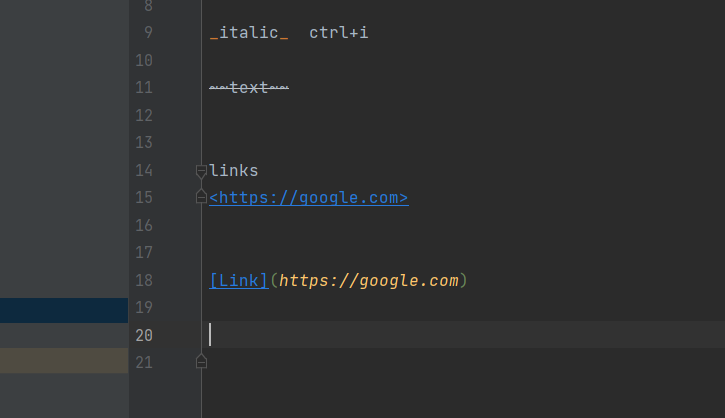

# Title
## Subtitle 
### heading3
#### heading4
##### heading 5
###### heading 6
**bold**  ctrl+b

_italic_  ctrl+i

~~text~~


links
<https://google.com>


[Link](https://google.com)




liste

1. prvi
2. drugi
3. tr

   1.test
4. sonja
   5. sonja 2
   


* jedan red
  * drugi
* treci

+lista 


-treci nacin


---
horizontalna 

---

****

za cijele brojeve koristimo `int`

```java
int a= 10;
system.out.println("text");

```


* [ ] git

* [x] markdown


| Name  | Age | Surname |
|:------|:---:|--------:|
| Sonja | 281 |   juuuu |
| ku    | 29  |    kiii |


